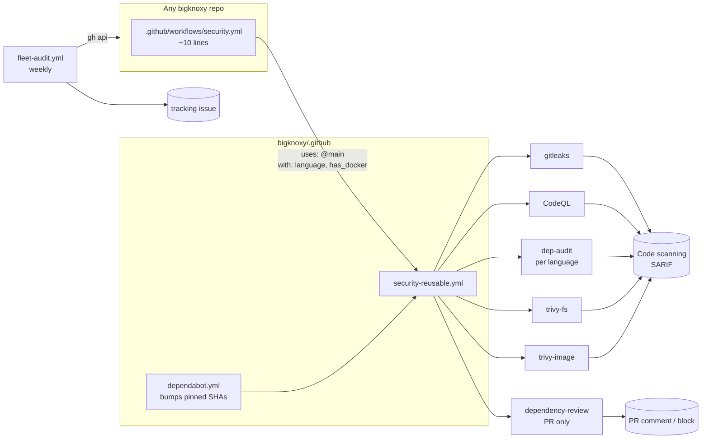
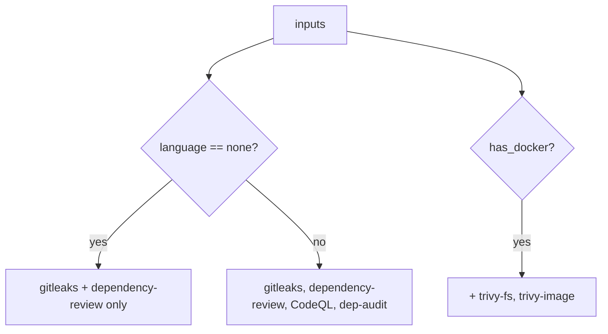

# Architecture

## Topology

## Job selection

| language | CodeQL id | audit tool |
|---|---|---|
| go | go | govulncheck |
| node | javascript-typescript | npm / pnpm / yarn / bun audit |
| python | python | pip-audit |
| rust | rust | cargo audit |
| dotnet | csharp | dotnet list package --vulnerable |

## Design decisions

- **Pinned SHAs, bumped centrally.** Only this repo's Dependabot touches action versions.
- **Blocking by default.** Every scanner exits non-zero on findings. Suppress per-repo with
  `.gitleaksignore`, `.trivyignore`, or CodeQL config, never with `continue-on-error`.
- **dependency-review only on pull_request.** The action needs a base/head diff.
- **`@main` reference.** Trade-off: instant rollout of fixes vs. a bad push breaking every
  repo. Mitigated by branch protection on this repo.

## Security controls

| control | where |
|---|---|
| least-privilege `permissions: contents: read` | top of reusable + caller |
| `security-events: write` scoped to SARIF jobs only | codeql, trivy-* |
| `pull-requests: write` scoped to dependency-review | dependency-review |
| `--ignore-scripts` on installs | node audit |
| secrets: only `GITHUB_TOKEN` via `secrets: inherit` | gitleaks |

Last updated: 2026-09-04
